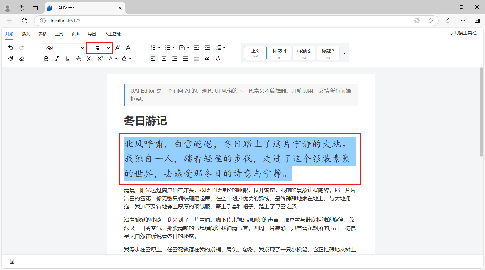

# 文档编辑

UAI Editor 提供了强大且方便的文档编辑功能。这些功能都放置在“开始”选项卡下。

## 标题设置

选中需要设置的文本，点击工具栏中的标题设置选项，可以设置标题样式。

比如，可以将文本设置为一级标题。

## 字体设置

选中需要设置的文本，点击工具栏中的字体选项，可以设置字体样式。

比如，可以将文本设置为楷体。

## 字号设置

选中需要设置的文本，点击工具栏中的字号选项，可以设置字体大小。

比如，可以将文本设置为二号。

## 样式设置

UAI Editor 也可以设置字体的基础样式。

### 粗体

选中需要设置的文本，点击工具栏中的粗体按钮，可以设置文本为粗体。

### 斜体

选中需要设置的文本，点击工具栏中的斜体按钮，可以设置文本为斜体。

### 下划线

选中需要设置的文本，点击工具栏中的下划线按钮，可以设置文本加下划线。

### 删除线

选中需要设置的文本，点击工具栏中的删除线按钮，可以设置文本加删除线。

### 下标

选中需要设置的文本，点击工具栏中的下标按钮，可以设置文本为下标。

### 上标

选中需要设置的文本，点击工具栏中的上标按钮，可以设置文本为上标。

### 字体颜色

选中需要设置的文本，点击工具栏中的字体颜色设置选项，可以设置文本的颜色。

### 背景颜色

选中需要设置的文本，点击工具栏中的背景颜色设置选项，可以设置文本的背景颜色。

### 有序列表

选中需要设置的文本，点击工具栏中的有序列表设置选项，可以设置有序列表。

### 无序列表

选中需要设置的文本，点击工具栏中的无序列表设置选项，可以设置无序列表。

### 缩进

选中需要设置的文本，点击工具栏中的缩进按钮，可以设置文本缩进。

### 左对齐

选中需要设置的文本，点击工具栏中的左对齐按钮，可以设置文本左对齐。

### 居中对齐

选中需要设置的文本，点击工具栏中的居中对齐按钮，可以设置文本居中对齐。

### 右对齐

选中需要设置的文本，点击工具栏中的右对齐按钮，可以设置文本右对齐。

### 引用

选中需要设置的文本，点击工具栏中的引用按钮，可以设置引用。

