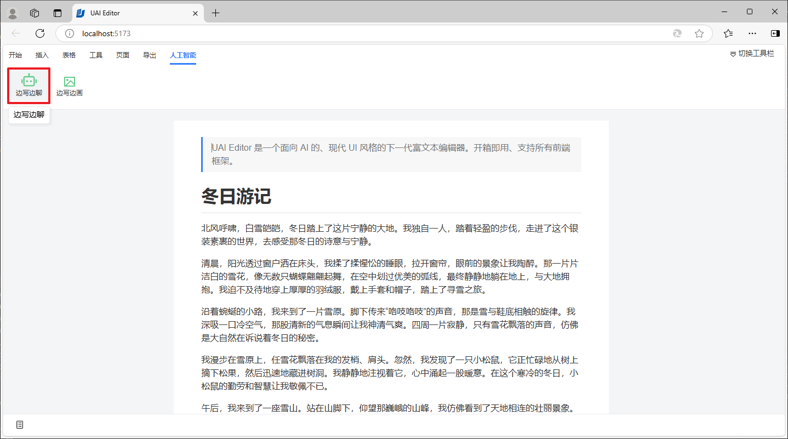
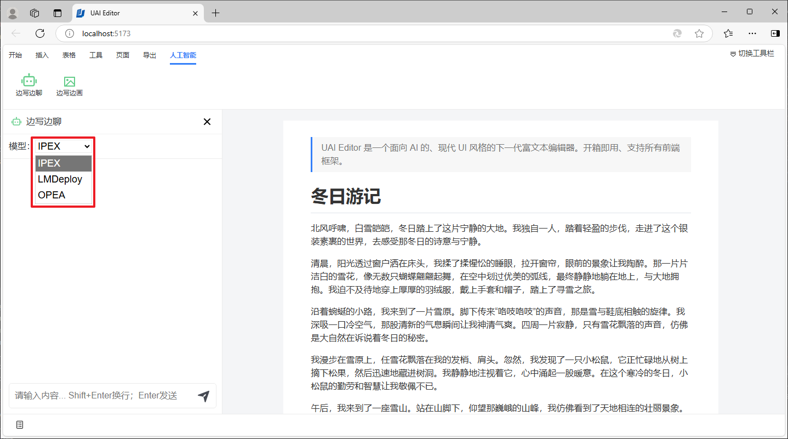
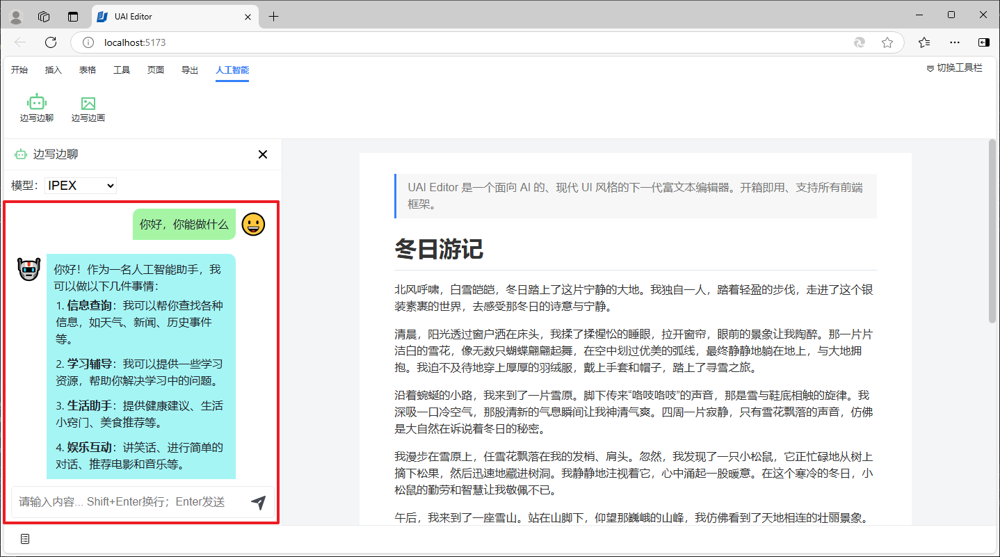
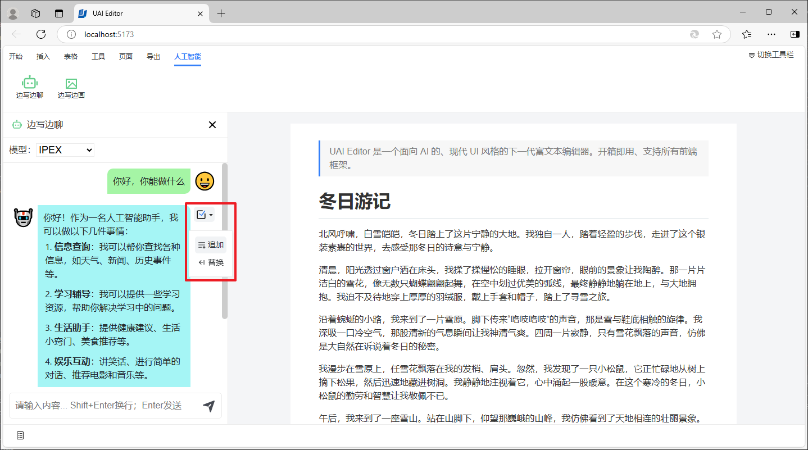
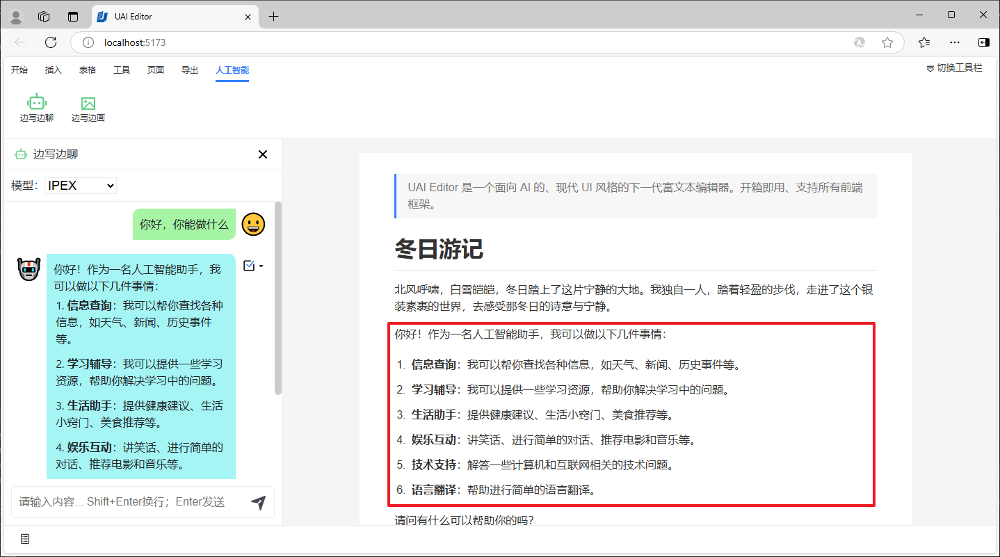
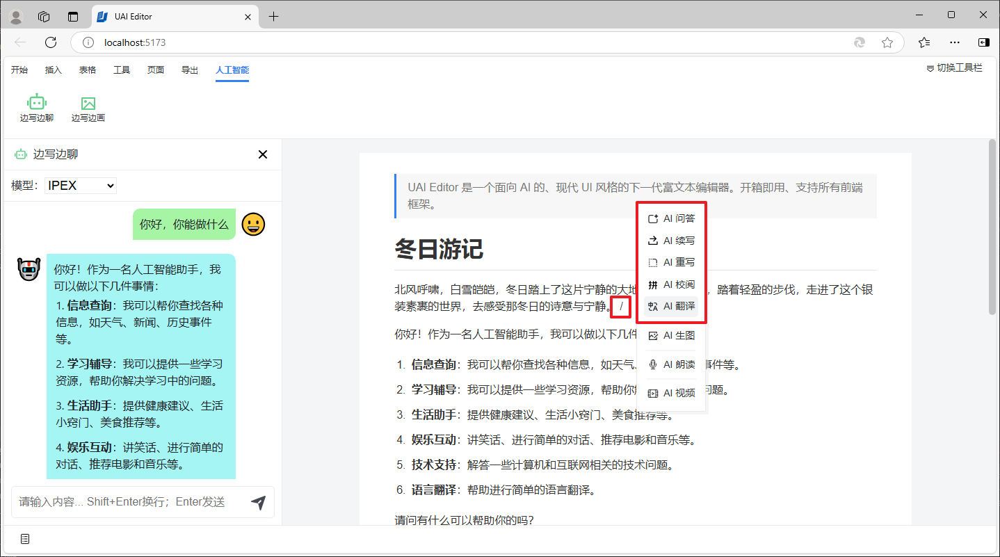
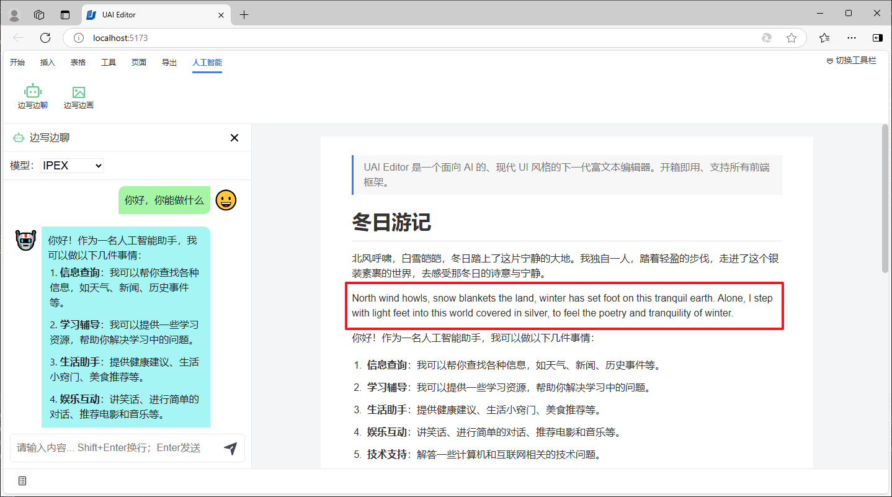

# 文本生成

UAI Editor 支持与大模型进行对话，生成文本，这些功能包含两部分：边写边聊 和 快捷命令。

## 边写边聊

在人工智能选项卡下，点击工具栏中的边写边聊按钮。

在打开的对话面板界面，我们可以选择需要对话的后端模型服务，IPEX、OPEA、其他公有或私有化部署的模型都可以。

对话结果将会展示在对话窗口中。

鼠标移动到对话内容上，可以展示出操作菜单，通过操作菜单我们可以将对话内容插入到文档中或替换文档中选中的内容。

将在文档中的光标之后插入对话内容。

## 快捷命令

除了通过对话面板进行大模型对话，我们还提供了与大模型对话的快捷命令。将光标移动到文档中需要大模型生成内容的地方，输入空格+斜线：` /` 可以弹出快捷命令。

比如，我们选择大模型翻译，则会在光标后插入翻译后的内容。

其他快捷命令的功能类似。
