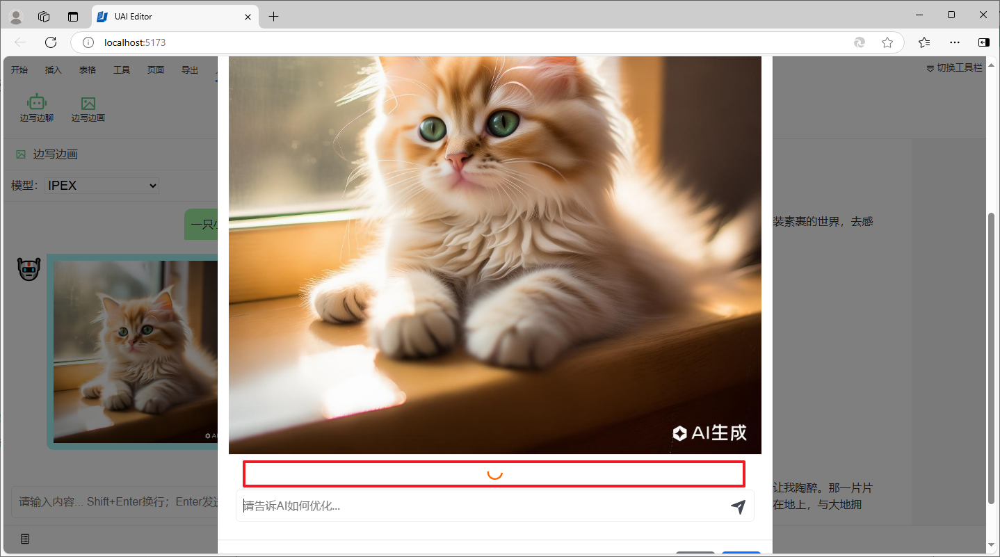
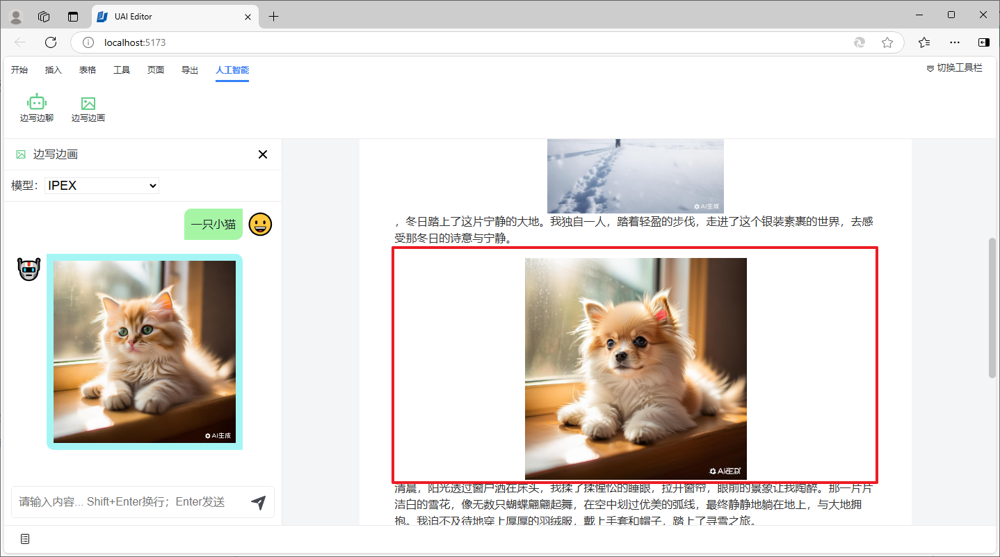

# 图片优化

UAI-Editor 支持对插入、生成的图片进行优化，也就是图生图。

在文档中选择需要优化的图片，在弹出的浮动菜单中点击图片重绘按钮。

在模态对话框中，操作类型选择图片优化。

在提示词输入框中输入想要优化的内容。

等待模型对图片进行优化。

优化完成后，我们可以从优化的结果中选择一幅自己比较满意的图片，然后点击确定按钮进行确认。

最后，文档中的原始图片将会替换为经过优化的图片。

