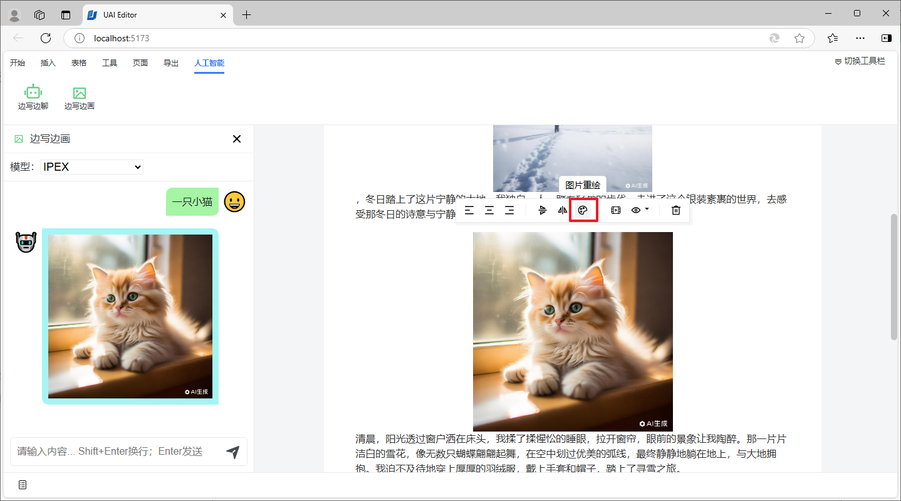
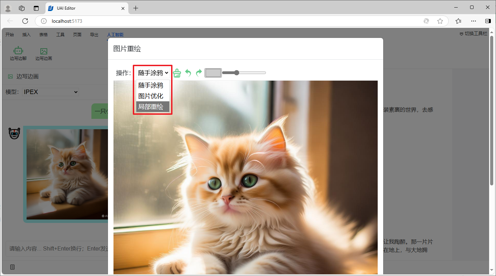
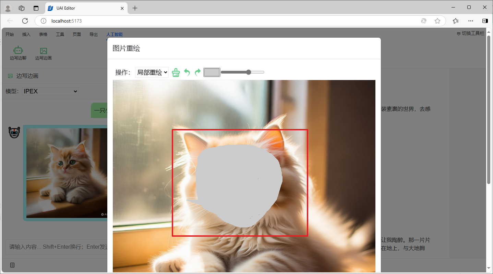
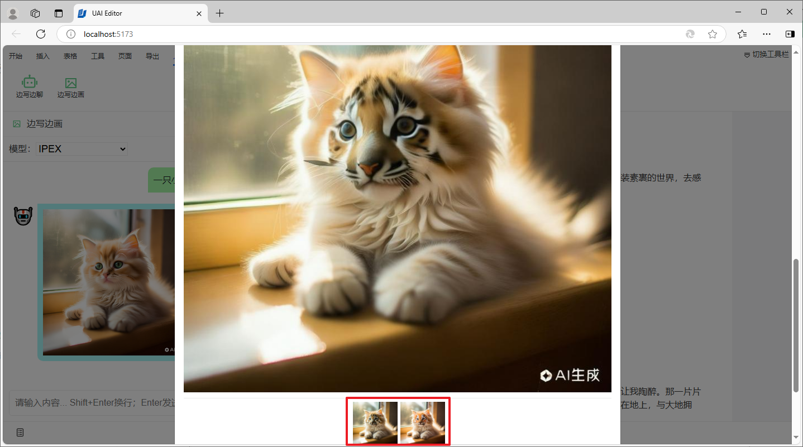
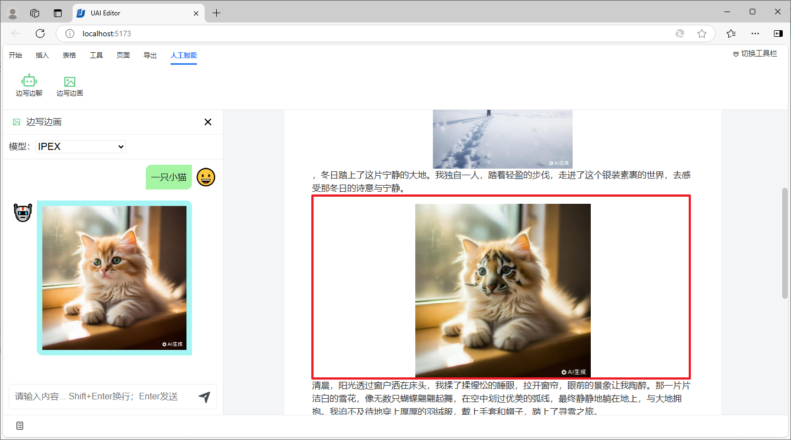

# 局部重绘

UAI-Editor 支持对插入、生成的图片进行优化，对指定的局部区域进行重新绘制。

在文档中选择需要优化的图片，在弹出的浮动菜单中点击图片重绘按钮。

在模态对话框中，操作类型选择局部重绘。

在图片上涂选需要重新绘制的部分区域。

在提示词输入框中输入想要重新绘制的内容。

重绘完成后，我们可以从结果中选择一幅自己比较满意的图片，然后点击确定按钮进行确认。

最后，文档中的原始图片将会替换为经过局部重新绘制的图片。

