# 附件插入

UAI Editor 提供了多媒体附件数据的插入，支持图片、语音、视频等。这些功能都放置在“插入”选项卡下。

## 插入链接

选中文本，或者不选择文本数据，点击工具栏中插入链接按钮。

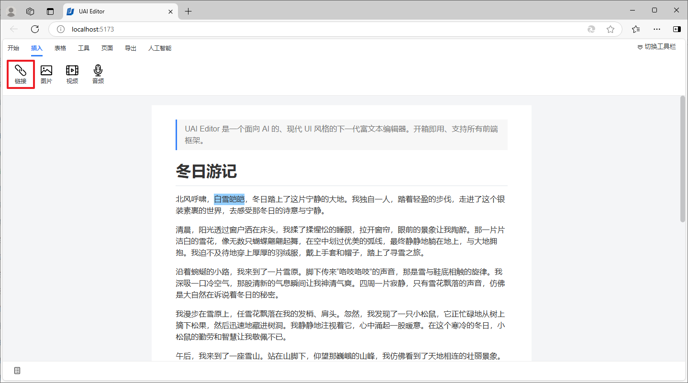

在模态窗口中输入链接地址及显示的文字，点击确定按钮。

在文档中就会新增链接信息，点击链接即可访问。

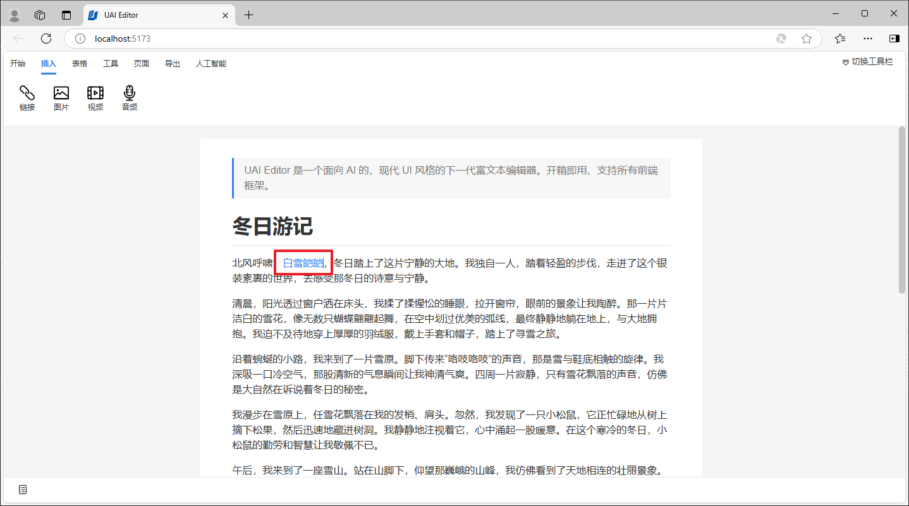

## 插入图片

将光标移动到需要插入图片的位置，点击工具栏中的插入图片按钮。

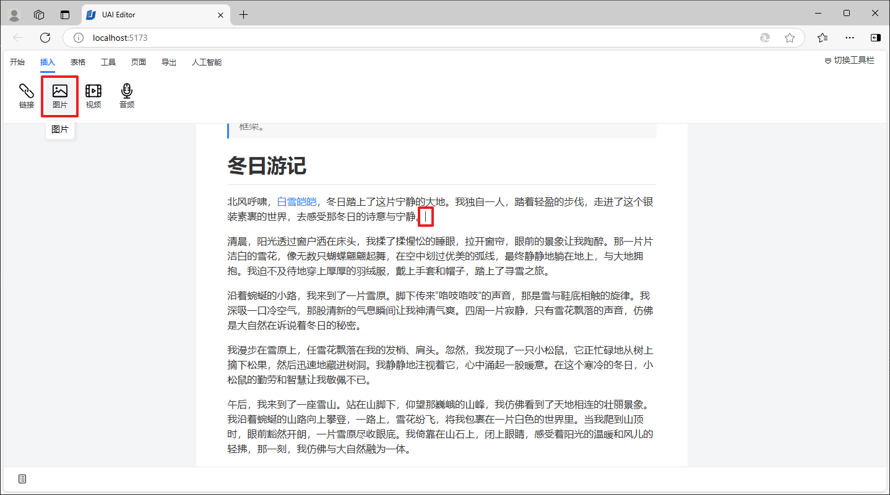

在文件选择对话框中选择需要插入的图片，点击打开按钮。

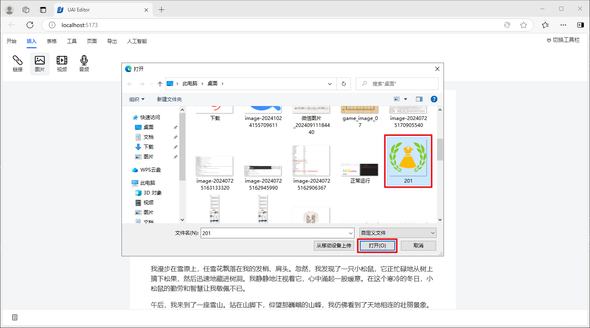

等待图片上传、加载。

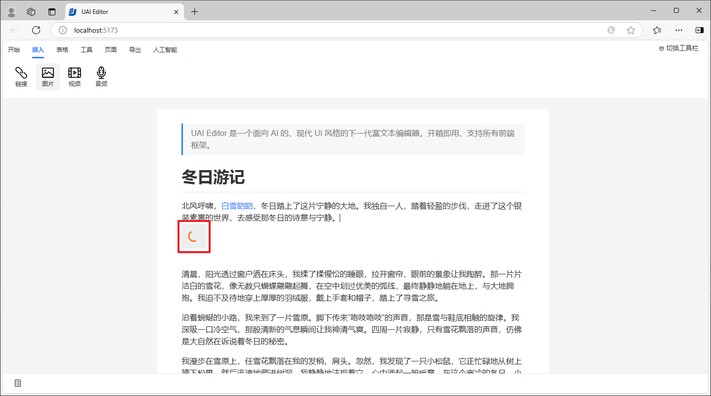

最后就会在文档中插入图片信息。

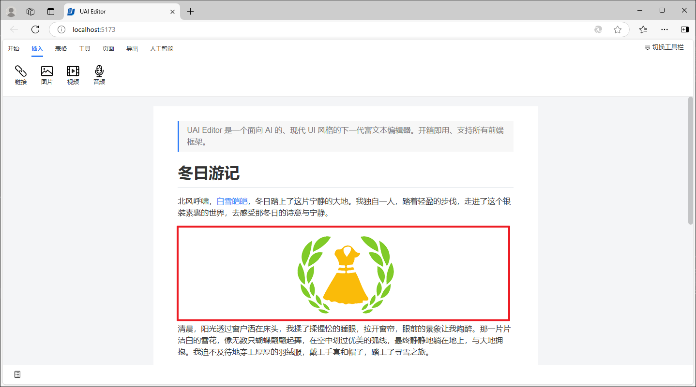

## 插入视频

将光标移动到需要插入视频的位置，点击工具栏中的插入视频按钮。

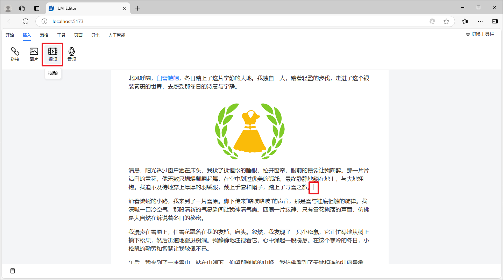

在文件选择对话框中选择需要插入的视频，点击打开按钮。

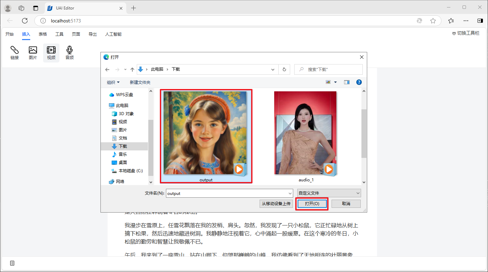

最后就会在文档中插入视频信息。

## 插入音频

将光标移动到需要插入音频的位置，点击工具栏中的插入音频按钮。

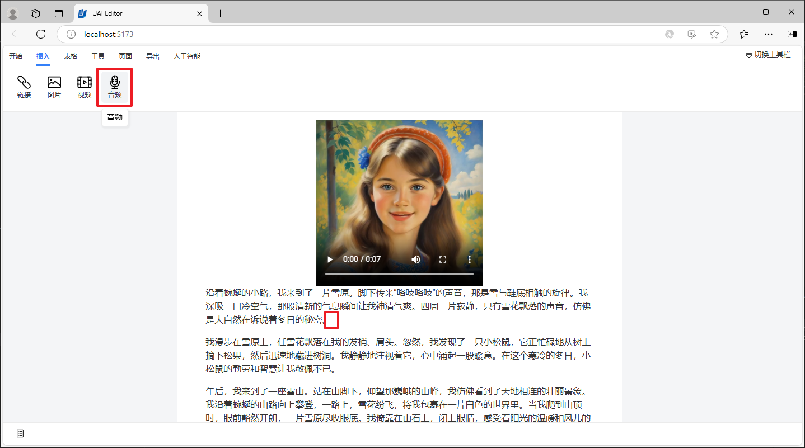

在文件选择对话框中选择需要插入的音频，点击打开按钮。

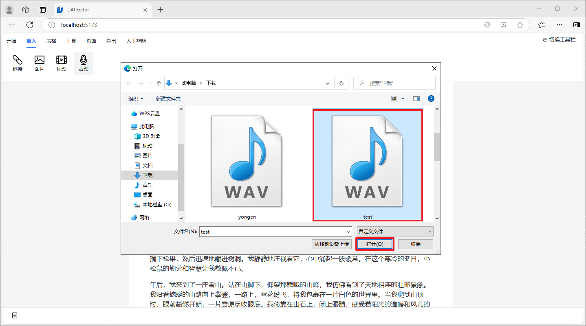

最后就会在文档中插入音频信息。

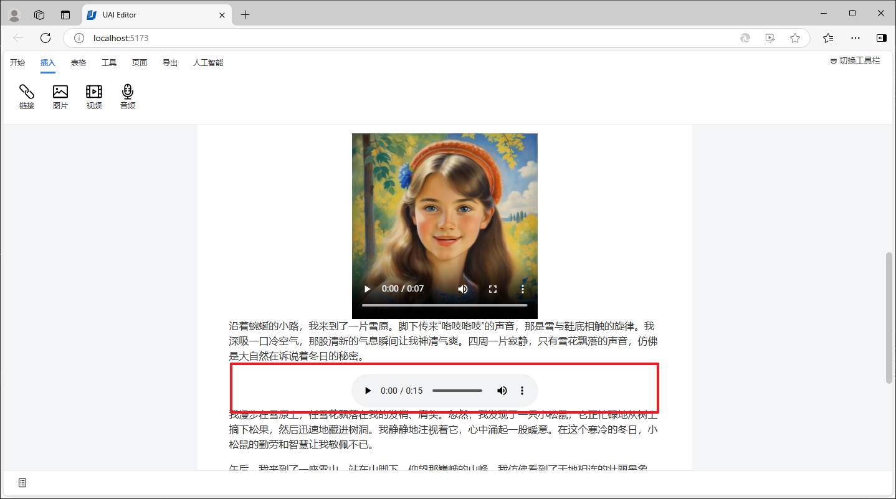
