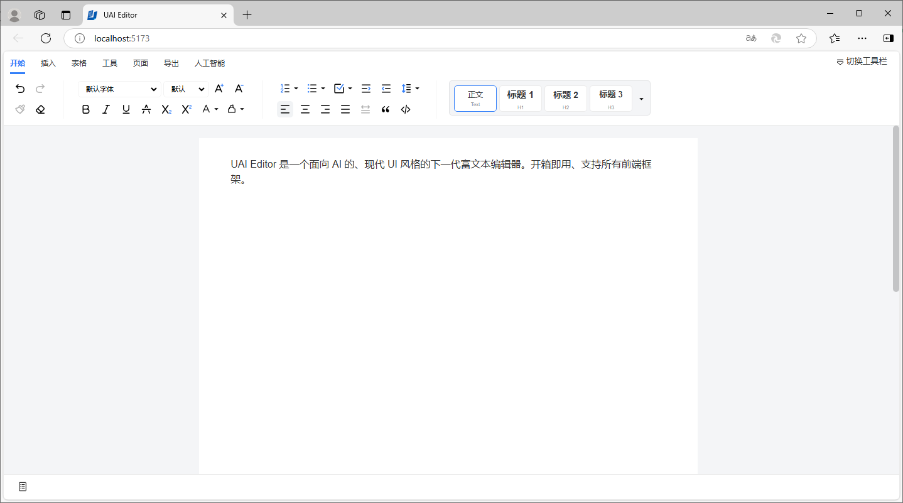
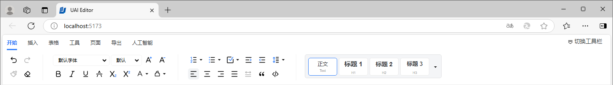
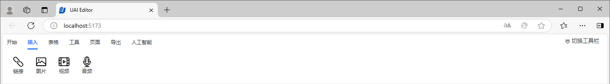
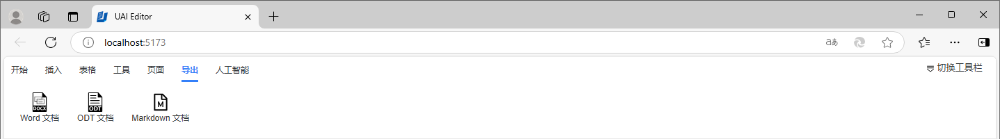
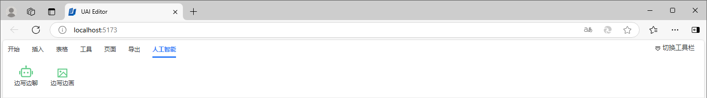
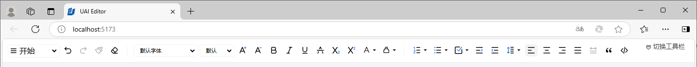
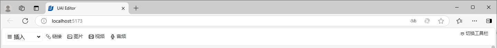
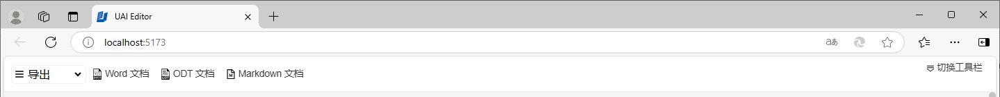
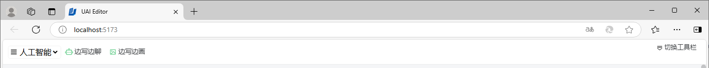

# 开始使用

本节中，我们将介绍如何安装、集成和使用 UAI Editor。

我们推荐用户参照我们的最佳实践进行操作。

## 运行条件

UAI Editor 是基于 Typescript 开发、浏览器访问、AI 驱动的，因此其开发运行环境需要：

* **开发环境：** 软件开发需要安装：`nodejs`、`npm`等。
* **运行环境：** 软件运行需要浏览器：`Chrome`、`Edge`、`Firefox`等。
* **模型部署：** 私有模型部署需要：GPU、Python、Pytorch、IPEX、OPEA、模型权重等。

## 软件安装

### 基础软件安装

首先，我们需要安装 `nodejs`、`npm`等用于开发的基础软件。

Node.js 可以通过不同的方式安装，所有主要平台的官方软件包均可在 [https://nodejs.cn/download/](https://nodejs.cn/download/) 获得。

一种非常方便的安装 Node.js 的方法是通过包管理器，[https://nodejs.cn/download/package-manager/](https://nodejs.cn/download/package-manager/) 中列出了适用于 macOS、Linux 和 Windows 的其他软件包管理器。

### 有爱文档安装

其次，我们需要安装 UAI Editor 软件，软件已经打包发布到 [https://www.npmjs.com/](https://www.npmjs.com/) 平台，可以直接通过以下命令安装：

```bash
npm i uai-editor
```

## 软件集成

然后，我们可以将 UAI Editor 与自己的项目进行集成。

作为一个独立的纯前端文档编辑器，UAI Editor 可以独立使用，也可以轻松无缝集成到 Vue、React、Layui、Angular 等几乎任何前端框架。

### 独立使用

* index.html

```html
<!doctype html>
<html lang="en">
<head>
    <meta charset="UTF-8"/>
    <meta name="viewport" content="width=device-width, initial-scale=1.0"/>
    <title>UAI Editor</title>
    <link rel="icon" href="/favicon.png" />
</head>
<body>
    <div id="uai-editor"></div>
    <script type="module" src="/src/main.ts"></script>
</body>
</html>
```

* main.ts

```js
import { UAIEditor } from "uai-editor";
import "uai-editor/dist/style.css";

new UAIEditor({
    element: "#uai-editor",
    content: 'UAI Editor 是一个面向 AI 的、现代 UI 风格的下一代富文本编辑器。开箱即用、支持所有前端框架。',
})
```

### 与 VUE 集成

```ts
<template>
  <div ref="editorDiv"/>
</template>

<script lang="ts">
import { UAIEditor } from "uai-editor";
import "uai-editor/dist/style.css";

export default {
  mounted(){
    new UAIEditor({
      element: this.$refs.editorDiv as Element,
      content: 'UAI Editor 是一个面向 AI 的、现代 UI 风格的下一代富文本编辑器。开箱即用、支持所有前端框架。',
    })
  }
}
</script>
```

### 与 React 集成

```js
import {useEffect, useRef} from 'react';
import { UAIEditor } from "uai-editor";
import "uai-editor/dist/style.css";

function App() {
    const divRef = useRef(null);
    useEffect(() => {
        if (divRef.current) {
            const uaiEditor = new UAIEditor({
                element: divRef.current,
                content: 'UAI Editor 是一个面向 AI 的、现代 UI 风格的下一代富文本编辑器。开箱即用、支持所有前端框架。',
            })
            return ()=>{
                uaiEditor.destroy();
            }
        }
    }, [])

    return (
        <>
            <div ref={divRef} />
        </>
    )
}

export default App
```

## 软件运行

最后，我们需要运行项目，执行以下命令可以运行项目或自己的项目：

```bash
npm run dev
```

软件运行成功后，打开浏览器，访问对应的地址，如果是独立运行默认地址是 [http://localhost:5173/](http://localhost:5173/)，我们可以看到运行结果。



### 强大的工具栏

为了方便用户完成文档内容编辑，UAI Editor 提供了强大的工具栏，集成了常用的功能。

#### Ribbon风格

我们提供了类似 Microsoft Word 的 Ribbon 风格的工具栏。

* 开始



* 插入



* 导出



* 人工智能



#### Classic风格

同时我们还提供了传统风格的工具栏，可以无缝切换。

* 开始



* 插入



* 导出



* 人工智能




### 丰富的快捷键

为了方便用户快速完成文档内容编辑，UAI Editor 提供了丰富的快捷键。

* **基本会话**

| 命令 | Windows/Linux | macOS |
| ----- | ----- | ----- |
| 复制 | `Control` + `C` | `Cmd` + `C` |
| 剪切 | `Control` + `X` | `Cmd` + `X` |
| 粘贴 | `Control` + `V` | `Cmd` + `V` |
| 无格式粘贴 | `Control` + `Shift` + `V` | `Cmd` + `Shift` + `V` |
| 撤销 | `Control` + `Z` | `Cmd` + `Z` |
| 重做 | `Control` + `Shift` + `Z` | `Cmd` + `Shift` + `Z` |
| 添加换行 | `Shift` + `Enter` | `Shift` + `Enter` |

* **文本格式化**

| 命令 | Windows/Linux | macOS |
| ----- | ----- | ----- |
| 粗体 | `Control` + `B` | `Cmd` + `B` |
| 斜体 | `Control` + `I` | `Cmd` + `I` |
| 下划线 | `Control` + `U` | `Cmd` + `U` |
| 删除线 | `Control` + `Shift` + `S` | `Cmd` + `Shift` + `S` |
| 文本高亮 | `Control` + `Shift` + `H` | `Cmd` + `Shift` + `H` |
| 行内代码 | `Control` + `E` | `Cmd` + `E` |

* **段落格式化**

| 命令 | Windows/Linux | macOS |
| ----- | ----- | ----- |
| 应用普通文本样式 | `Control` + `Alt` + `0` | `Cmd` + `Alt` + `0` |
| 应用标题样式 1 | `Control` + `Alt` + `1` | `Cmd` + `Alt` + `1` |
| 应用标题样式 2 | `Control` + `Alt` + `2` | `Cmd` + `Alt` + `2` |
| 应用标题样式 3 | `Control` + `Alt` + `3` | `Cmd` + `Alt` + `3` |
| 应用标题样式 4 | `Control` + `Alt` + `4` | `Cmd` + `Alt` + `4` |
| 应用标题样式 5 | `Control` + `Alt` + `5` | `Cmd` + `Alt` + `5` |
| 应用标题样式 6 | `Control` + `Alt` + `6` | `Cmd` + `Alt` + `6` |
| 有序列表 | `Control` + `Shift` + `7` | `Cmd` + `Shift` + `7` |
| 无序列表 | `Control` + `Shift` + `8` | `Cmd` + `Shift` + `8` |
| 任务列表 | `Control` + `Shift` + `9` | `Cmd` + `Shift` + `9` |
| 块引用 | `Control` + `Shift` + `B` | `Cmd` + `Shift` + `B` |
| 左对齐 | `Control` + `Shift` + `L` | `Cmd` + `Shift` + `L` |
| 居中对齐 | `Control` + `Shift` + `E` | `Cmd` + `Shift` + `E` |
| 右对齐 | `Control` + `Shift` + `R` | `Cmd` + `Shift` + `R` |
| 分散对齐 | `Control` + `Shift` + `J` | `Cmd` + `Shift` + `J` |
| 代码块 | `Control` + `Alt` + `C` | `Cmd` + `Alt` + `C` |
| 下标 | `Control` + `,` | `Cmd` + `,` |
| 上标 | `Control` + `.` | `Cmd` + `.` |

* **文本选择**

| 命令 | Windows/Linux | macOS |
| ----- | ----- | ----- |
| 全选 | `Control` + `A` | `Cmd` + `A` |
| 将所选内容向左扩展一个字符 | `Shift` + `←` | `Shift` + `←` |
| 将所选内容向右扩展一个字符 | `Shift` + `→` | `Shift` + `→` |
| 将选区向上扩展一行 | `Shift` + `↑` | `Shift` + `↑` |
| 将选区向下扩展一行 | `Shift` + `↓` | `Shift` + `↓` |
