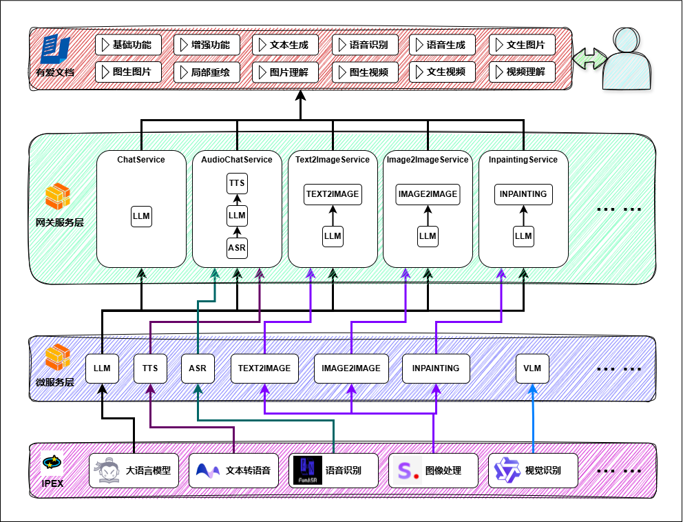

# 项目简介

UAI Editor 是一个基于 Typescript 的适合于国人使用的纯前端文档编辑器。UAI Editor 提供完善的文档编辑能力和 AI 创作能力，支持 Markdown 语法，支持基础的富文本编辑功能，支持插入多种格式的节点类型、提供了多种类型的实用工具。

作为一个独立的纯前端文档编辑器，UAI Editor 可以轻松无缝集成到 Vue、React、Layui、Angular 等几乎任何前端框架。

## 与众不同

### 场景丰富

* 无论您是：金融、教育、医疗、零售、互联网还是传统行业。
* 无论您是：文章创作、会议记录、学术论文还是知识库管理。
* 即便是个人笔记整理，UAI Editor 都能成为您得力的助手。

### 功能全面

* **基础：** 标题、正文、字体、字号、加粗、斜体、下划线、删除线、链接、行内代码、上标、下标、分割线、引用...
* **增强：** 撤销、重做、格式刷、橡皮擦、字体颜色、背景颜色、对齐方式、行高、待办事项、有（无）序列表、段落缩进...
* **附件：** 支持图片、语音、视频、文件功能，支持选择上传、支持拖动调整大小...
* **Markdown：** 标题、引用、表格、图片、代码块、高亮块、各种列表、粗体、斜体、删除线...
* **AI：** AI 续写、AI 优化、AI 校对、AI 翻译、自定义 AI 菜单及其 Prompts...
* **更多：** 国际化、主题切换...

### 简单易用

* UAI Editor 基于 Web Component 开发，支持与任意主流的前端框架集成。
* UAI Editor 提供了友好的 UI 界面，强大的工具栏支持，助您轻松实现文档编辑。
* UAI Editor 提供了便捷的快捷键支持，让您的文档编辑快人一步。

### AI 驱动

* UAI Editor 旨在解决 Web 应用中文档编辑的复杂性，提供类似 Microsoft Word 的强大编辑能力，同时保持 Web 应用的便捷性。
* UAI Editor 打造了一个完全由 AI 驱动的富文本编辑器，同时支持对接任意大模型，包括私有的大模型。
* UAI Editor 支持全模态大模型，包括文本生成、语音识别、语音生成、文生图、图生图、局部重绘、图片理解、文生视频、图生视频、视频理解等。
* UAI Editor 私有模型适配多种环境，包括英伟达显卡、天数智芯显卡、Pytorch、IPEX等，同时支持OPEA服务编排。

## 项目架构

软件架构如图：

