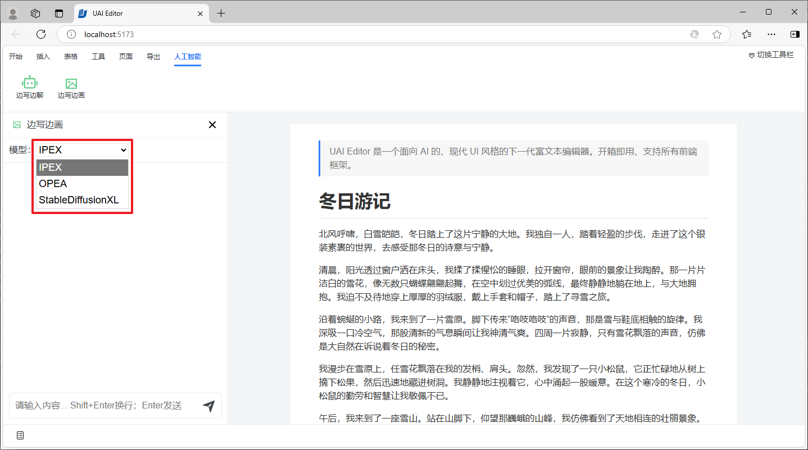

# 文生图片

UAI Editor 支持与大模型进行对话，生成图片，这些功能包含两部分：边写边画 和 快捷命令。

## 边写边画

在人工智能选项卡下，点击工具栏中的边写边画按钮。

在打开的对话面板界面，我们可以选择用来生成图片的后端模型服务，IPEX、OPEA、其他公有或私有化部署的文生图模型都可以。

图片生成结果将会展示在对话窗口中。

鼠标移动到图片结果上，可以展示出操作菜单，通过操作菜单我们可以将生成的图片插入到文档中。

将在文档中的光标之后插入生成的图片。

## 快捷命令

除了通过对话面板进行图片生成，我们还提供了与图片生成的快捷命令。将光标移动到文档中需要插入图片的地方，输入空格+斜线：` /` 可以弹出快捷命令。

选择AI生图，会在光标后插入生成的图片。

